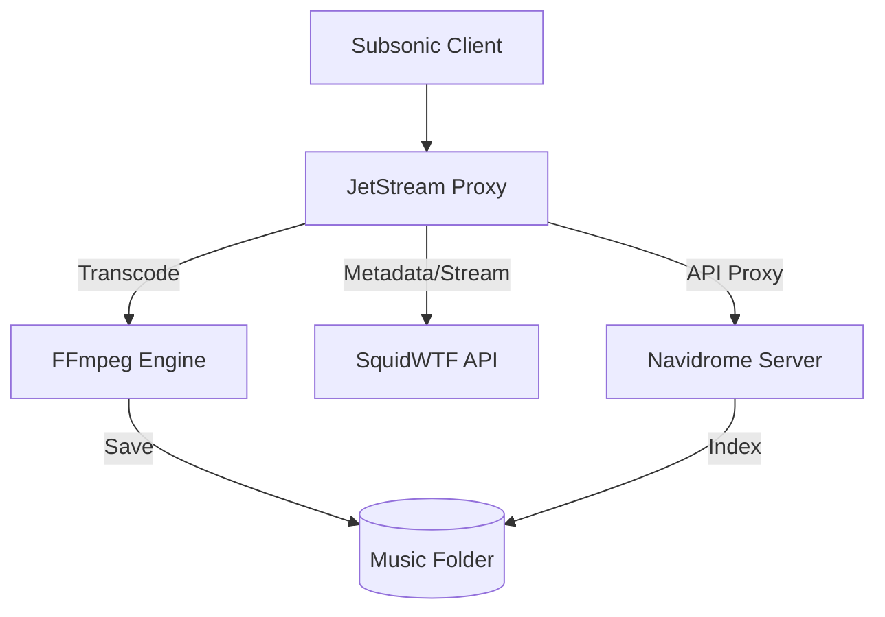

# JetStream - Navidrome Proxy

> [!WARNING]
> **AI-Generated Service Notice**: This repository was built with the assistance of agentic AI. While it has been tested for the documented use cases, it is provided "as is" without warranty of any kind. **Use it at your own risk.**

The **JetStream Proxy** is a high-performance Subsonic API proxy designed to integrate external music providers (like Tidal via SquidWTF) seamlessly into Navidrome. It operates as a "Download-on-Demand" sync service with real-time transcoding and local-first serving optimization.

## Background & Inspiration

This project is a **fork/inspiration** of [octo-fiestarr](https://github.com/bransoned/octo-fiestarr). It aims to provide similar functionality with a focus on Go-based high-performance proxying and integrated "Sync-on-Play" mechanics.

## Features

- **Subsonic API Proxy**: Intercepts requests to handle external metadata and streaming transparently.
- **On-Demand Sync**: Syncs albums and songs to your local Navidrome music folder automatically when browsed or played.
- **Real-time Transcoding**: Uses `ffmpeg` to transcode high-quality streams into efficient formats like **Opus** (or MP3/AAC) on-the-fly.
- **Local-First Serving**: Detects if a song has already been synced to disk and serves it directly, drastically reducing latency (~400ms vs ~2s) and saving bandwidth.
- **Search Optimization**: Configurable search limits to keep API usage efficient.
- **Docker Ready**: Easy deployment with Docker Compose and automated CI/CD via GHCR.

For a detailed list of recent changes, see the [Changelog](CHANGELOG.md).

## Architecture



## Setup & Configuration

### Prerequisites
- Docker & Docker Compose
- A Navidrome instance

### Configuration (Environment Variables)

Configure these in your `docker-compose.yml` or `.env` file:

| Variable | Description | Default |
|----------|-------------|---------|
| `PORT` | Local listening port | `8080` |
| `NAVIDROME_URL` | URL of your Navidrome instance | `http://navidrome:4533` |
| `MUSIC_FOLDER` | Path to sync music to | `/music` |
| `SEARCH_FOLDER` | Path to store temporary search ghost files | `/music/search` |
| `SEARCH_LIMIT` | Max items per search category | `50` |
| `DOWNLOAD_FORMAT` | Preferred audio format (`opus`, `mp3`, `aac`) | `opus` |

### Installation

1. Clone the repository.
2. Configure your environment variables in `docker-compose.yml`.
3. Start the service:
   ```bash
   docker compose up -d --build
   ```

## Development

The project is written in Go 1.21.

### Build locally:
```bash
go build -o jetstream ./cmd/jetstream
```

## License
MIT
